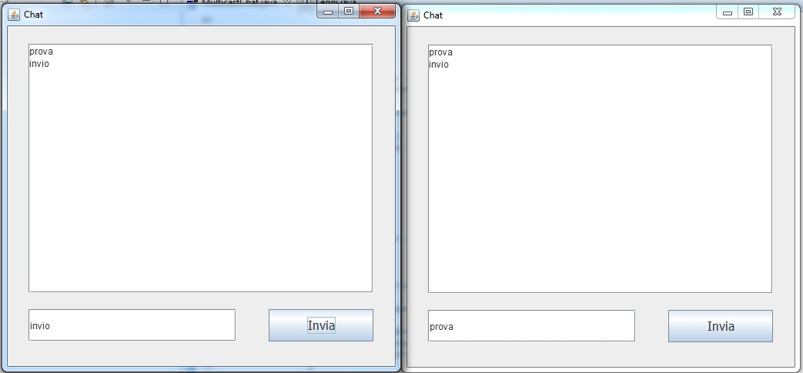

<!DOCTYPE html PUBLIC "-//W3C//DTD HTML 4.01//EN" "http://www.w3.org/TR/html4/strict.dtd">
<html><head>
  
  <meta content="text/html; charset=ISO-8859-1" http-equiv="content-type">
  

  
</head><body>

<h1>Chat multicast in Java</h1>

Nel multicasting (one to many
communication)&nbsp; un messaggio spedito da
un processo e indirizzato a un gruppo di multicast viene ricevuto da tutti i membri di quel gruppo. 
In IPv4 gli indirizzi di un gruppo appartengono alla classe D con un
range che va da 224.0.0.0 a 239.255.255.255.  
 
Nel range si distinguono indirizzi di multicast globali e indirizzi di
multicast locali che delimitano diversi ambiti di gestione: 
1) Organization Local Scope: intervallo [239.192.0.0 - 239.192.255.255]; 
2) Site Local Scope: intervallo [239.255.0.0 - 239.255.255.255]; 
3) Link Local Scope: intervallo [224.0.0.0 - 224.0.0.255]; 
4) Global Scope: indirizzi al di fuori dei range precedenti;
  
Gli indirizzi globali devono essere unici in tutta la rete mentre gli
indirizzi locali devono essere unici solo nell'ambito di appartenenza; 
 
La classe MulticastSocket della libreria java.net, estendendo la classe
DatagramSocket, da un lato effettua l'overriding dei metodi esistenti
mentre dall'altro introduce nuove funzionalità: 
1) per unirsi ad un gruppo di multicast; 
2) per uscire dal gruppo di multicast; 
3) per inviare messaggi ai membri del gruppo di multicast; 
4) per ricevere messaggi inviati da un processo e indirizzati al gruppo di
multicast; 
5) per limitare la diffusione di un datagramma: TTL scoping&nbsp; (Time
to Live memorizzato in un campo dell' header del pacchetto IP); 
 Uso: eseguire due istanze dello stesso programma: 
 
 
 

 

</body></html>
